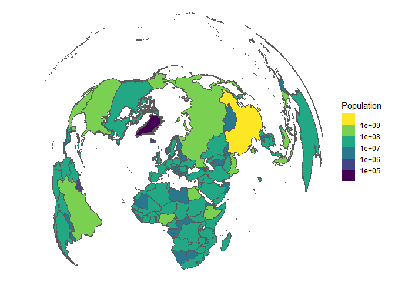
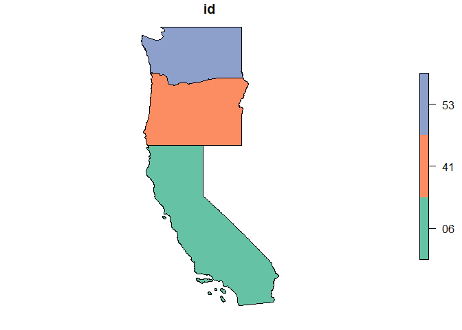

<!-- README.md is generated from README.Rmd. Please edit that file -->

# geolink

<!-- badges: start -->

<!-- badges: end -->

Quickly identify areal identifiers like NUTS, ISO-3, GAUL, INSPIRE, AGS
or FIPS and link them to their respective polygon geometries.
Convenience wrapper around common API wrappers and standards to
facilitate spatial analysis for people who don’t know spatial analysis.

## Installation

You can install the development version of `{geolink}` from GitHub with:

``` r
# install.packages("pak")
pak::pak("jslth/geolink")
```

## Example

For basic use, `{geolink}` has a single function. Given a dataset with
spatial identifiers, it automatically links the respective geometries:

``` r
library(geolink)
#> Loading required package: sf
#> Linking to GEOS 3.13.0, GDAL 3.10.1, PROJ 9.5.1; sf_use_s2() is TRUE
library(gt)

ctpop <- gt::countrypops
ctpop <- ctpop[ctpop$year == 2020, ]
ctpop_link <- enrich(ctpop, id_col = "country_code_2")
#> • Detected iso2c codes, converting to iso3c.
#> • No geolinker specified, using "naturalearth".
ctpop_link
#> Simple feature collection with 215 features and 5 fields (with 26 geometries empty)
#> Geometry type: GEOMETRY
#> Dimension:     XY
#> Bounding box:  xmin: -5155245 ymin: -5472681 xmax: 16683810 ymax: 15313100
#> Projected CRS: ETRS89-extended / LAEA Europe
#> # A tibble: 215 × 6
#>    country_name         country_code_2 country_code_3  year population
#>  * <chr>                <chr>          <chr>          <int>      <int>
#>  1 Aruba                AW             ABW             2020     106585
#>  2 Afghanistan          AF             AFG             2020   38972230
#>  3 Angola               AO             AGO             2020   33428486
#>  4 Albania              AL             ALB             2020    2837849
#>  5 Andorra              AD             AND             2020      77700
#>  6 United Arab Emirates AE             ARE             2020    9287289
#>  7 Argentina            AR             ARG             2020   45376763
#>  8 Armenia              AM             ARM             2020    2805608
#>  9 American Samoa       AS             ASM             2020      46189
#> 10 Antigua & Barbuda    AG             ATG             2020      92664
#> # ℹ 205 more rows
#> # ℹ 1 more variable: geometry <GEOMETRY [m]>
```

As you can see by the output, `enrich()` automatically normalizes the
country codes to ISO-3 and links them to country polygons from [Natural
Earth](https://www.naturalearthdata.com/). However, many very small
countries cannot be linked to any polygon. That’s because Natural Earth
swallows up some smaller countries at lower resolutions. One solution is
to select a different geolinker.
[`geoBoundaries`](https://www.geoboundaries.org/), for example, does not
suffer from the same issue:

``` r
ctpop_link <- enrich(ctpop, id_col = "country_code_2", linker = "geoboundaries")
#> • Detected iso2c codes, converting to iso3c.
ctpop_link
#> Simple feature collection with 215 features and 5 fields (with 12 geometries empty)
#> Geometry type: GEOMETRY
#> Dimension:     XY
#> Bounding box:  xmin: -7143855 ymin: -5469869 xmax: 16798790 ymax: 15341140
#> Projected CRS: ETRS89-extended / LAEA Europe
#> # A tibble: 215 × 6
#>    country_name         country_code_2 country_code_3  year population
#>  * <chr>                <chr>          <chr>          <int>      <int>
#>  1 Aruba                AW             ABW             2020     106585
#>  2 Afghanistan          AF             AFG             2020   38972230
#>  3 Angola               AO             AGO             2020   33428486
#>  4 Albania              AL             ALB             2020    2837849
#>  5 Andorra              AD             AND             2020      77700
#>  6 United Arab Emirates AE             ARE             2020    9287289
#>  7 Argentina            AR             ARG             2020   45376763
#>  8 Armenia              AM             ARM             2020    2805608
#>  9 American Samoa       AS             ASM             2020      46189
#> 10 Antigua & Barbuda    AG             ATG             2020      92664
#> # ℹ 205 more rows
#> # ℹ 1 more variable: geometry <MULTIPOLYGON [m]>
```

``` r
library(ggplot2)

ggplot(ctpop_link) +
    geom_sf(aes(fill = population)) +
    scale_fill_viridis_b("Population", transform = "log10") +
    theme_void()
```



If a country code is detected, `enrich()` will always convert it to
ISO-3. However, the function can also handle other regional identifiers,
e.g., FIPS codes:

``` r
west_coast <- c("06", "41", "53")
west_coast <- enrich(west_coast, linker = "fips", crs = 4326)
plot(west_coast)
```



To view all geolinkers registered, run:

``` r
all_geolinkers()
#>  [1] "gadm"          "unhcr"         "nuts"          "inspire"      
#>  [5] "lau"           "ags"           "fips"          "geoboundaries"
#>  [9] "naturalearth"  "postcode"
```

A number of “geolinkers” are pre-registered, but you can also register
your own workflows:

``` r
check <- function(ids) {
  grepl("x: -?[0-9]{0,3}, y: -?[0-9]{0,2}", ids)
}

parse <- function(ids) {
  strcapture(
    "x: (-?[0-9]{0,3}), y: (-?[0-9]{0,2})",
    ids,
    proto = list(x = double(), y = double())
  )
}

link <- function(.data, id_col, x, y, link_crs) {
  geom <- Map(\(x, y) sf::st_point(c(x, y)), x, y)
  geom <- sf::st_as_sfc(geom, crs = link_crs)
  .data$geometry <- geom
  sf::st_as_sf(.data)
}

register_geolinker(
  "coords_fmt",
  link = link,
  check = check,
  parse = parse
)
```

``` r
test_data <- data.frame(id = c("x: 8, y: 47", "x: 9, y: 46", "x: 10, y: 45"))
enrich(test_data, link_crs = 4326)
#> • No geolinker specified, using "coords_fmt".
#> Simple feature collection with 3 features and 1 field
#> Geometry type: POINT
#> Dimension:     XY
#> Bounding box:  xmin: 4168779 ymin: 2432033 xmax: 4321000 ymax: 2656106
#> Projected CRS: ETRS89-extended / LAEA Europe
#> # A tibble: 3 × 2
#>   id                    geometry
#> * <chr>              <POINT [m]>
#> 1 x: 8, y: 47  (4168779 2656106)
#> 2 x: 9, y: 46  (4243442 2543530)
#> 3 x: 10, y: 45 (4321000 2432033)
```

Registered geolinkers are portable and can be exported and imported on
other machines. This could be useful for workshops or for making
geolinking workflows accessible to colleagues.

``` r
# on original machine:
export_geolinkers(path = ".", name = "my_geolinkers")

# on new machine:
import_geolinkers("./my_geolinkers")
```
